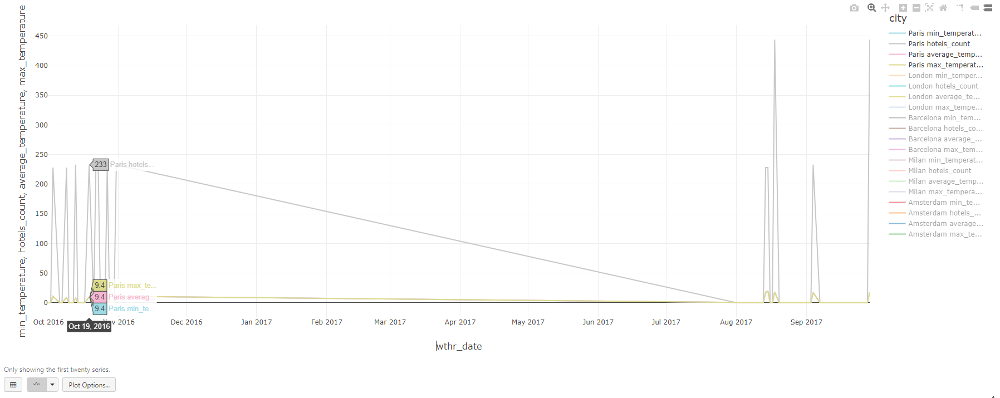
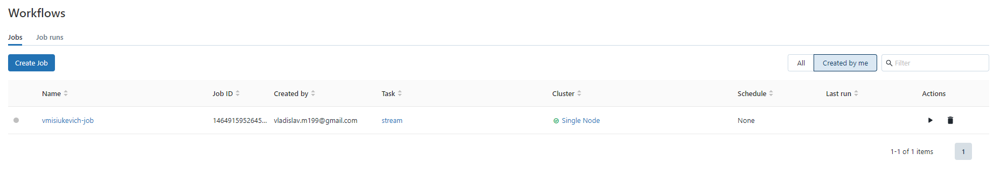

# Installation
```bash
git clone https://github.com/Vlad-Misiukevich/m13_sparkstreaming_python_azure.git
```
# Requirements
* Windows OS
* Python 3.8
* kubernetes-cli
* azure-cli
* terraform
# Description
1. Login to Azure:  
`az login`

2. Deploy infrastructure with terraform:  
`terraform init`  
`terraform plan -out terraform.plan`  
`terraform apply terraform.plan`

3. Incremental copy of hotel/weather data from Azure ADLS gen2 storage into provisioned with terraform Azure ADLS gen2 storage with a delay(30 seconds), one day per cycle:  
`.\src\main\python\job.py`  
  

4. Create Spark Structured Streaming application in Databricks:  

5. Calculating number of distinct hotels in the city for each city each day:  

6. The same calculating in 10 minutes (the data is changing):

7. Data is over and stream is waiting for a new data:  

8. Calculating average/max/min temperature in the city in the city for each city each day:
  
9. The same calculating in 10 minutes (the data is changing):  

10. Data is over and stream is waiting for a new data: 

11. Preparing data for visualisation:  

12. Data visualization for 10 biggest cities (in example Paris, London, Barcelona, Milan, Amsterdam are shown):  
* Paris
  
* London

* Barcelona

* Milan

* Amsterdam

13. Deploying Databricks Notebook on cluster:  
`terraform plan -out terraform.plan`  
`terraform apply terraform.plan` 



